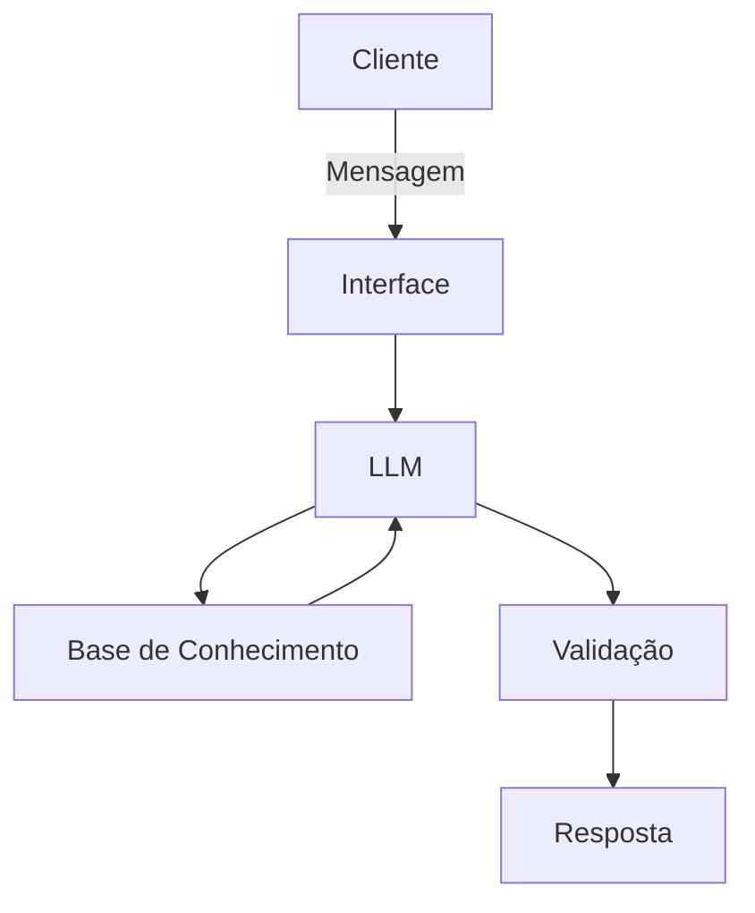

# Documentação do Agente

## Caso de Uso

### Problema
> Qual problema financeiro seu agente resolve?

Muitos usuários não conseguem interpretar seus próprios dados financeiros, como histórico de transações, perfil de investidor e objetivos financeiros, o que dificulta a tomada de decisões conscientes e alinhadas com sua realidade.

### Solução
> Como o agente resolve esse problema de forma proativa?

O agente atua como um assistente financeiro inteligente que analisa dados do usuário, como perfil financeiro, histórico de transações e atendimentos anteriores, para fornecer respostas contextualizadas. Ele explica conceitos financeiros de forma simples, apresenta o progresso em relação às metas e sugere produtos financeiros compatíveis com o perfil do usuário.

### Público-Alvo
> Quem vai usar esse agente?

Pessoas que desejam entender melhor sua situação financeira a partir de dados já existentes, especialmente iniciantes que têm dificuldade em interpretar informações financeiras e tomar decisões com base nelas.

---

## Persona e Tom de Voz

### Nome do Agente
Portal

### Personalidade
> Como o agente se comporta? (ex: consultivo, direto, educativo)

Educativo, direto e acessível, com foco em simplificar conceitos financeiros e orientar o usuário de forma prática.

### Tom de Comunicação
> Formal, informal, técnico, acessível?

Informal e didático, evitando termos técnicos sempre que possível e explicando quando necessário.

### Exemplos de Linguagem
- Saudação: "Fala! Vamos organizar sua vida financeira hoje?"
- Confirmação: "Entendi, você quer saber se vale a pena parcelar isso."
- Erro/Limitação: "Não tenho dados suficientes para te responder com segurança, mas posso te explicar como isso funciona."

---

## Arquitetura

### Diagrama

### Componentes

| Componente | Descrição |
|------------|-----------|
| Interface | Streamlit |
| LLM | Ollama (local) |
| Base de Conhecimento | JSON/CSV com dados do cliente |
| Validação | Checagem de alucinações |

---

## Segurança e Anti-Alucinação

### Estratégias Adotadas

- [x] O agente responde apenas com base nos dados fornecidos
- [x] Evita recomendações de investimento fora do perfil do usuário
- [x] Quando não tem certeza, informa limitação ao usuário
- [x] Não inventa dados não presentes na base

### Limitações Declaradas
> O que o agente NÃO faz?

- Não substitui um consultor financeiro profissional
- Recomendações são básicas e baseadas em dados simulados
- Não acessa dados reais de contas bancárias
- Pode simplificar conceitos para facilitar o entendimento
